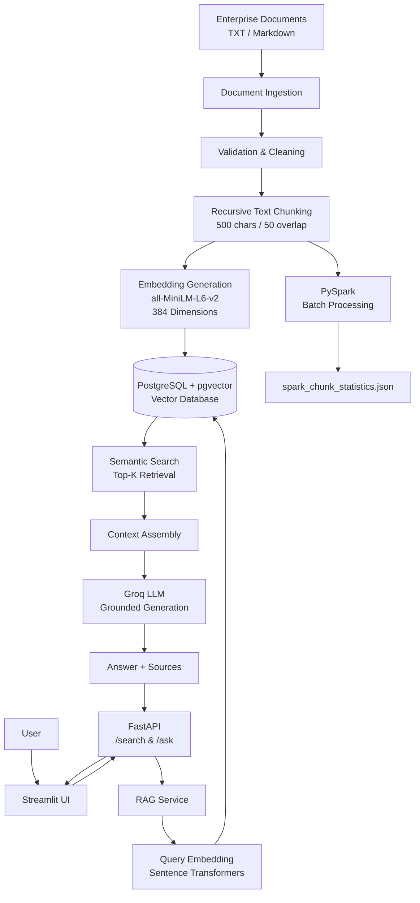

# Enterprise RAG Pipeline

> Production-oriented Retrieval-Augmented Generation (RAG) platform for enterprise knowledge retrieval, semantic search, and grounded AI responses.

[](https://www.python.org/)
[](https://fastapi.tiangolo.com/)
[](https://www.postgresql.org/)
[](https://github.com/pgvector/pgvector)
[](https://streamlit.io/)
[](https://www.docker.com/)

---

## Overview

The **Enterprise RAG Pipeline** is an end-to-end Retrieval-Augmented Generation system designed to answer questions from enterprise documentation using semantic search and grounded large language model generation.

The system processes enterprise policy documents through a structured data pipeline:

```text
Documents
    ↓
Ingestion
    ↓
Validation
    ↓
Cleaning
    ↓
Semantic Chunking
    ↓
Embedding Generation
    ↓
PostgreSQL + pgvector
    ↓
Semantic Retrieval
    ↓
Context Assembly
    ↓
Groq LLM
    ↓
Grounded Answer + Sources
```

The project demonstrates how modern data engineering, vector databases, LLMs, APIs, and containerization can be combined into a production-oriented RAG architecture.

---

## Key Features

- End-to-end enterprise document ingestion
- Document validation and cleaning
- Recursive semantic text chunking
- Sentence Transformer embeddings
- 384-dimensional vector representations
- PostgreSQL with pgvector
- Semantic similarity search
- Retrieval-Augmented Generation
- Groq-powered LLM responses
- FastAPI REST API
- Interactive Streamlit interface
- PySpark batch processing
- Docker containerization
- Automated test suite
- Environment-based configuration
- Source-aware grounded responses

---

## Architecture

The platform is divided into two main flows:

### 1. Data Ingestion Pipeline

Enterprise documents are processed, validated, cleaned, chunked, embedded, and stored in PostgreSQL with pgvector.

### 2. RAG Serving Pipeline

User questions are submitted through the Streamlit interface, processed by FastAPI, converted into embeddings, matched against stored vectors, and supplied as context to the Groq LLM.

### Architecture Diagram



The architecture separates the **offline document processing pipeline** from the **online RAG serving layer**, allowing the two components to evolve independently.

---

## RAG Workflow

The question-answering workflow follows these steps:

```text
User Question
      ↓
Streamlit Interface
      ↓
FastAPI /ask Endpoint
      ↓
RAG Service
      ↓
Query Embedding
      ↓
PostgreSQL + pgvector
      ↓
Semantic Similarity Search
      ↓
Top-K Relevant Chunks
      ↓
Context Assembly
      ↓
Groq LLM
      ↓
Grounded Response
      ↓
Sources
      ↓
Streamlit Interface
```

The system retrieves relevant enterprise knowledge before generating the response, reducing the dependency on the LLM's internal knowledge.

---

## Data Engineering Pipeline

The ingestion pipeline follows a structured processing workflow:

```text
Raw Documents
      ↓
Document Loader
      ↓
Validation
      ↓
Cleaning
      ↓
Chunking
      ↓
Embedding Generation
      ↓
Vector Storage
```

### Document Ingestion

The pipeline loads enterprise documentation from the `data/raw` directory.

Example documents include:

- Annual Leave Policy
- Data Retention Policy
- Employee Expense Policy
- Information Security Policy
- Remote Work Policy

### Validation

Documents are checked before entering the downstream processing pipeline.

Validation helps ensure that:

- Files are readable
- Required content is available
- Empty documents are rejected
- Invalid inputs do not enter the vector database

### Chunking

Documents are split into smaller overlapping chunks using a recursive text splitter.

Current configuration:

```text
Chunk Size: 500 characters
Chunk Overlap: 50 characters
```

Chunk overlap helps preserve contextual continuity between adjacent chunks.

---

## Embedding Generation

The project uses:

```text
sentence-transformers/all-MiniLM-L6-v2
```

Each document chunk is converted into a **384-dimensional vector representation**.

These vectors allow the system to perform semantic similarity search rather than relying only on keyword matching.

---

## Vector Database

The project uses:

```text
PostgreSQL
     +
pgvector
```

The vector database stores:

- Document content
- Metadata
- Embeddings
- Source information

During retrieval, the user's question is converted into an embedding and compared against stored document vectors.

The highest-ranked chunks are then passed to the RAG generation layer.

---

## PySpark Processing

PySpark is included for scalable batch processing and analytics.

The Spark pipeline processes chunk-level information and produces:

```text
spark_chunk_statistics.json
```

This demonstrates how the project can extend from a local Python pipeline toward distributed data processing workloads.

---

## FastAPI

The backend exposes REST endpoints through FastAPI.

### Health Check

```http
GET /health
```

### Semantic Search

```http
POST /search
```

Example request:

```json
{
  "query": "How many days can employees work remotely?",
  "top_k": 3
}
```

### RAG Question Answering

```http
POST /ask
```

Example request:

```json
{
  "question": "How many days can employees work remotely?",
  "top_k": 3
}
```

The `/ask` endpoint performs retrieval and grounded generation before returning the response.

---

## Streamlit Interface

The project includes a custom Streamlit interface for interacting with the RAG system.

The interface provides:

- Chat interface
- Document information
- Source references
- API health status
- Analytics
- Configuration information

The UI communicates with the FastAPI backend rather than directly accessing the vector database.

---

## Project Structure

```text
enterprise-rag-pipeline/
│
├── app/
│   ├── api/
│   │   └── routes.py
│   │
│   ├── core/
│   │
│   ├── db/
│   │
│   ├── ingestion/
│   │   ├── loaders.py
│   │   ├── pipeline.py
│   │   ├── validator.py
│   │   └── chunker.py
│   │
│   ├── retrieval/
│   │   └── vector_store.py
│   │
│   ├── services/
│   │   └── rag_service.py
│   │
│   ├── main.py
│   └── streamlit_app.py
│
├── data/
│   ├── raw/
│   └── processed/
│
├── docs/
│   └── architecture.md
│
├── scripts/
│   └── spark_transform.py
│
├── tests/
│
├── .dockerignore
├── .env
├── .gitignore
├── docker-compose.yml
├── Dockerfile
├── README.md
└── requirements.txt
```

---

## Technology Stack

| Component | Technology |
|---|---|
| Programming Language | Python |
| API | FastAPI |
| LLM | Groq |
| RAG | LangChain |
| Embeddings | Sentence Transformers |
| Vector Database | PostgreSQL + pgvector |
| Data Processing | PySpark |
| Frontend | Streamlit |
| Containerization | Docker |
| Testing | Pytest |
| Version Control | Git |

---

## Installation

### 1. Clone the Repository

```bash
git clone <YOUR_GITHUB_REPOSITORY_URL>
cd enterprise-rag-pipeline
```

### 2. Create a Virtual Environment

Windows:

```powershell
python -m venv .venv
```

Activate:

```powershell
.venv\Scripts\Activate.ps1
```

### 3. Install Dependencies

```powershell
pip install -r requirements.txt
```

---

## Environment Variables

Create a `.env` file in the project root:

```env
GROQ_API_KEY=your_groq_api_key

POSTGRES_HOST=localhost
POSTGRES_PORT=5432
POSTGRES_DB=ragdb
POSTGRES_USER=postgres
POSTGRES_PASSWORD=postgres
```

Do **not** commit `.env` to Git.

Use `.env.example` as a safe template for sharing configuration requirements.

---

## Running PostgreSQL + pgvector

Start the database using Docker Compose:

```powershell
docker compose up -d postgres
```

Verify running containers:

```powershell
docker ps
```

The PostgreSQL service is exposed on:

```text
localhost:5432
```

---

## Running the Data Pipeline

Run the document ingestion pipeline:

```powershell
python -m app.ingestion.pipeline
```

The pipeline performs:

```text
Load
 ↓
Validate
 ↓
Clean
 ↓
Chunk
 ↓
Embed
 ↓
Store
```

---

## Running PySpark

Set the Python executable for PySpark:

```powershell
$pythonPath = (python -c "import sys; print(sys.executable)")
$env:PYSPARK_PYTHON = $pythonPath
$env:PYSPARK_DRIVER_PYTHON = $pythonPath
```

Run:

```powershell
python scripts\spark_transform.py
```

The Spark processing generates:

```text
spark_chunk_statistics.json
```

---

## Running FastAPI

Start the API:

```powershell
uvicorn app.main:app --reload
```

The API will be available at:

```text
http://localhost:8000
```

Interactive API documentation:

```text
http://localhost:8000/docs
```

---

## Running Streamlit

Start the Streamlit interface:

```powershell
streamlit run app\streamlit_app.py
```

The interface will be available through the local Streamlit URL displayed in the terminal.

---

## Docker

Build the application image:

```powershell
docker compose build
```

Start the complete stack:

```powershell
docker compose up -d
```

Check running services:

```powershell
docker compose ps
```

Stop the services:

```powershell
docker compose down
```

---

## Testing

The project includes automated tests for core components.

Run:

```powershell
pytest
```

The test suite covers key functionality including:

- API endpoints
- Document processing
- Validation
- Chunking
- Retrieval
- RAG components

---

## Example Questions

The system can answer questions based on the enterprise policy documents.

### Remote Work

```text
How many days can employees work remotely?
```

### Annual Leave

```text
How many annual leave days are available to full-time employees?
```

### Information Security

```text
What are the requirements for protecting company information?
```

### Data Retention

```text
How long should company data be retained?
```

The generated answers are based on retrieved document context rather than unrestricted model generation.

---

## Data Quality

The pipeline incorporates several data-quality controls:

- Input validation
- Empty-document detection
- Text cleaning
- Structured chunking
- Metadata preservation
- Vector dimension consistency
- Retrieval limits

These controls reduce the likelihood of malformed or irrelevant content entering the retrieval layer.

---

## Security Considerations

The project follows several basic security practices:

- API keys are stored through environment variables.
- `.env` is excluded from version control.
- Database credentials are configurable through environment variables.
- Sensitive configuration is not hardcoded into application logic.
- The RAG layer is designed around controlled enterprise document sources.

For a production deployment, additional controls would be required, including authentication, authorization, secrets management, network security, audit logging, rate limiting, and monitoring.

---

## Design Decisions

### Why PostgreSQL + pgvector?

Using PostgreSQL with pgvector allows structured relational data and vector search to coexist within the same database ecosystem.

### Why Sentence Transformers?

Sentence Transformers provide lightweight local embedding generation without requiring a separate external embedding API.

### Why FastAPI?

FastAPI provides a lightweight REST interface suitable for serving retrieval and RAG functionality.

### Why Streamlit?

Streamlit provides a fast way to build an interactive interface for demonstrating the RAG system.

### Why PySpark?

PySpark demonstrates how document-processing workloads can be extended toward distributed batch processing.

### Why Docker?

Docker provides a reproducible runtime environment and simplifies deployment across development and production environments.

---

## Current Capabilities

The current implementation supports:

- Enterprise document ingestion
- Document validation
- Text cleaning
- Recursive chunking
- Local embedding generation
- PostgreSQL vector storage
- Semantic retrieval
- RAG-based question answering
- Groq LLM integration
- FastAPI endpoints
- Streamlit interface
- PySpark processing
- Docker deployment
- Automated testing

---

## Future Improvements

Potential production enhancements include:

- Authentication and role-based access control
- Document upload through the UI
- Incremental document ingestion
- Document versioning
- Advanced metadata filtering
- Hybrid keyword + vector retrieval
- Reranking models
- Conversation memory
- Evaluation datasets
- RAG evaluation metrics
- Observability and monitoring
- CI/CD pipelines
- Cloud deployment
- Distributed vector search
- Enterprise secrets management

---

## Project Goals

This project demonstrates practical implementation of:

```text
Data Engineering
        +
Vector Databases
        +
Semantic Search
        +
Retrieval-Augmented Generation
        +
LLM Integration
        +
REST APIs
        +
Distributed Processing
        +
Containerization
```

The objective is to demonstrate how an enterprise knowledge system can be designed as a complete engineering pipeline rather than as an isolated LLM application.

---

## License

This project is intended for educational, portfolio, and demonstration purposes.

---

## Author

**Yash Khatri**

Data Engineer | AI & Data Engineering

---

## Acknowledgements

Built using open-source technologies including Python, FastAPI, PostgreSQL, pgvector, Sentence Transformers, PySpark, Streamlit, LangChain, Docker, and related ecosystem tools.